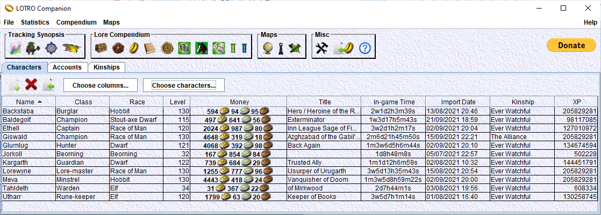

# LOTRO Companion
A companion for LOTRO players.

This is a desktop application for LOTRO players. It will help in many ways, but its main features are:
- track status of your characters
- simulate gear on your characters
- browse databases of game data (recipes, titles, emotes, deeds...)

Character data can be synchronized with the local LOTRO Client (Windows only).

Detailed documentation [here](https://github.com/LotroCompanion/lotro-companion-doc/blob/master/README.md).
Quick start guide [here](https://github.com/LotroCompanion/lotro-companion-doc/blob/master/UserManual/QuickStartGuide/main.md).

Discord: 
Facebook page is [here](https://www.facebook.com/lotrocompanion/).
Facebook group is [here](https://www.facebook.com/groups/1165974713535183).

Threads in the LOTRO Forum:

[Version 17.0 and 17.5](https://www.lotro.com/forums/showthread.php?688936-LotRO-Companion-17-0-(character-planner-character-status-tracker-lore-compendium))

[Version 16.0](https://www.lotro.com/forums/showthread.php?687808-LotRO-Companion-16-0-(character-planner-character-status-tracker-lore-compendium))

[Version 15.0](https://www.lotro.com/forums/showthread.php?686612-LotRO-Companion-15-0-(character-planner-character-status-tracker-lore-compendium))

[Version 14.0](https://www.lotro.com/forums/showthread.php?685329-LotRO-Companion-14-0-(character-planner-character-status-tracker-lore-compendium))

[Version 13.0](https://www.lotro.com/forums/showthread.php?681271-LotRO-Companion-13-0-(character-planner-character-status-tracker-lore-compendium))

[Version 12.0](https://www.lotro.com/forums/showthread.php?678167-LotRO-Companion-12-0-(character-planner-character-status-tracker-lore-compendium))

[Version 11.0](https://www.lotro.com/forums/showthread.php?676992-LotRO-Companion-11-0-(character-planner-character-status-tracker-lore-compendium))

[Version 10.0](https://www.lotro.com/forums/showthread.php?670129-LotRO-Companion-10-0-aka-X-\(character-planner-reputation-crafting-deeds-virtues-tracker-maps-deeds-recipes-t)

[Version 9.0](https://www.lotro.com/forums/showthread.php?666544-LotRO-Companion-9-0-(character-planner-reputation-crafting-deeds-virtues-tracker-maps-))

[Version 8.0](https://www.lotro.com/forums/showthread.php?664000-LotRO-Companion-(character-planner-reputation-crafting-deeds-virtues-tracker-maps-)-version-8-0-released!)

[Version 7.0](https://www.lotro.com/forums/showthread.php?660655-LotRO-Companion-(character-planner-and-more)-version-7-0-released!)

[Version 6.0](https://www.lotro.com/forums/showthread.php?658607-LotRO-Companion-(character-planner-and-more)-version-6-0-released!)

[Version 5.0](https://www.lotro.com/forums/showthread.php?656762-LotRO-Companion-(character-planner-and-more)-version-5-0-released!)

[Version 4.0](https://www.lotro.com/forums/showthread.php?651533-LOTRO-Companion-character-planner-version-4-0-released)

[Version 4.0beta1](https://www.lotro.com/forums/showthread.php?651024-LOTRO-Companion-version-4-0-beta1)

[Version 3.0](https://www.lotro.com/forums/showthread.php?505221-LOTRO-Companion-version-3-0)

[Version 2.0](https://www.lotro.com/forums/showthread.php?488951-LOTRO-Companion-version-2-0)

[Version 1.0](https://www.lotro.com/forums/showthread.php?480442-LOTRO-Companion-a-new-tool-for-your-LOTRO-toons)
